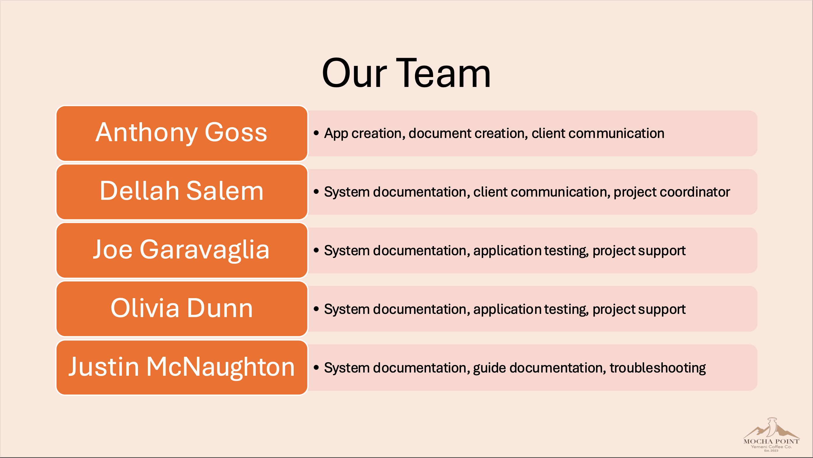
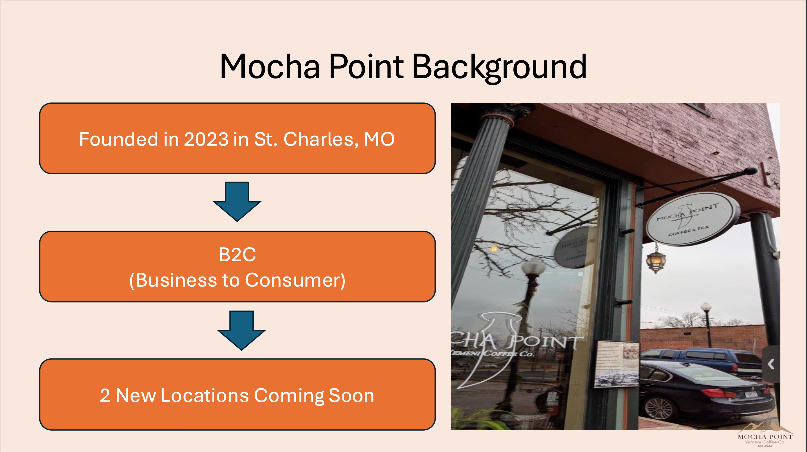
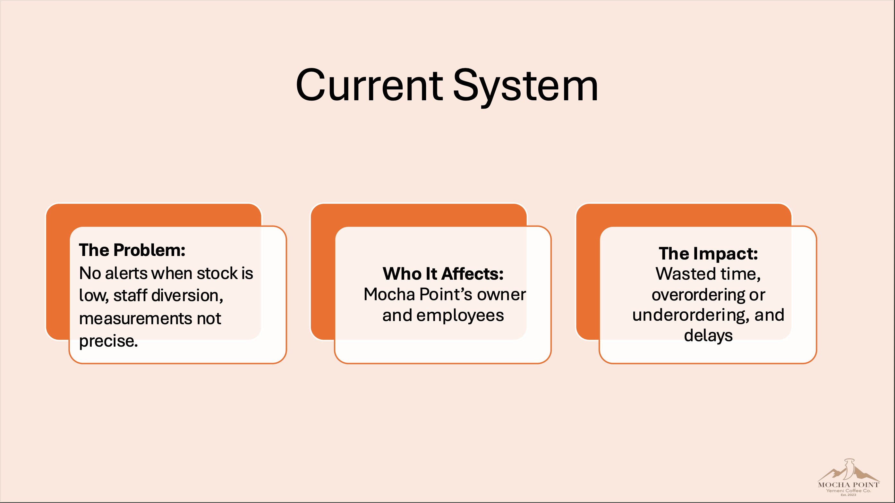
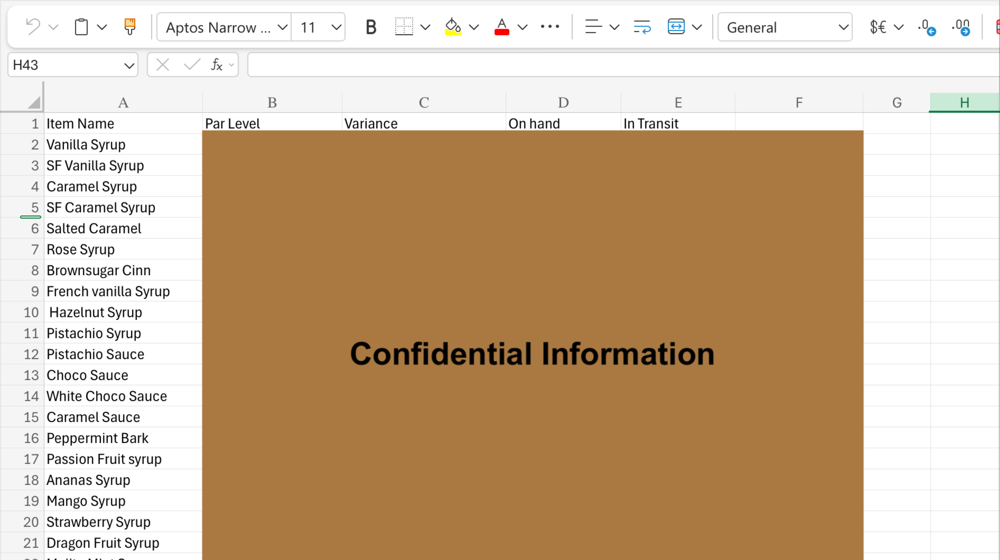
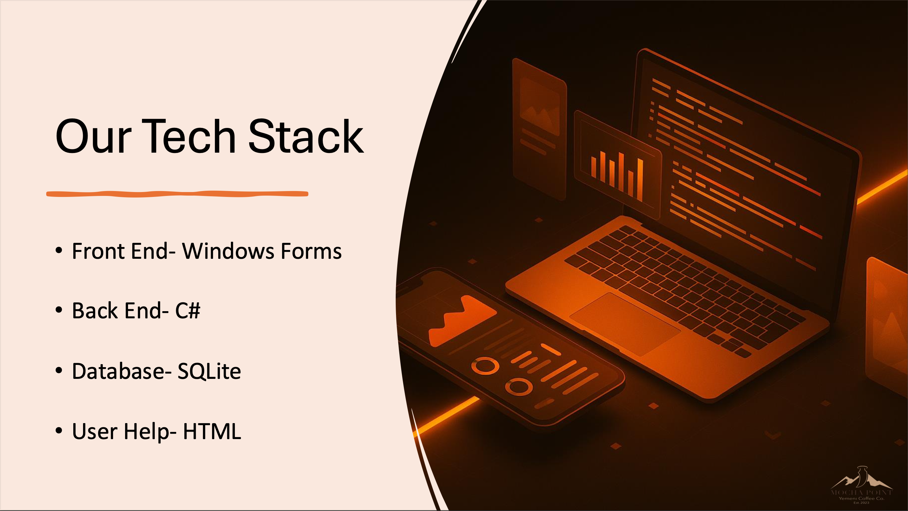
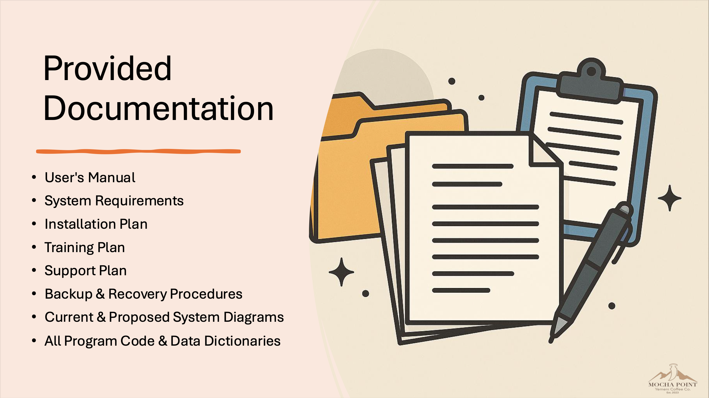
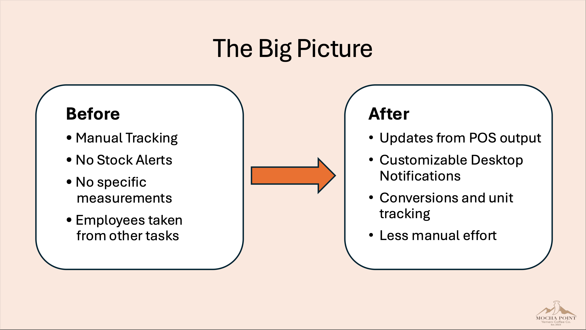

# Information Systems & Design – Mocha Point Inventory System

## Overview
As the **Systems Design Team Lead**, I:
- Conducted interviews to gather system requirements
- Designed database structures and logical models
- Created data flow and entity relationship diagrams
- Outlined proposed system functionality and process improvements
- Contributed to both system and user documentation
- Served as the main communicator between the client, professor, and team members to ensure alignment, clarity, and progress

## Key Deliverables
### Final App
- [Final App Zip](final%20app.zip)

### System Documentation
- [Meeting Minutes](system_documentation/Meeting%20Minutes.pdf)
- [Current ERD & DFD](system_documentation/Current%20ERD_DFD.pdf)
- [Proposed ERD & DFD](system_documentation/Proposed%20ERD_DFD.pdf)
- [Data Dictionary](system_documentation/Data%20Dictionary.pdf)

### User Documentation
- [System Requirements](user_documentation/System%20Requirements.pdf)
- [System Proposal](user_documentation/System%20Proposal.pdf)
- [Information System Proposal](user_documentation/Information%20System%20Proposal.pdf)
- [Request for Proposal](user_documentation/Request%20for%20Proposal.pdf)
- [Design Specifications](user_documentation/Design%20Specifications.pdf)
- [Baseline Project Plan](user_documentation/Baseline%20Project%20Plan.pdf)
- [Installation Plan](user_documentation/Installation%20Plan.pdf)
-�[Training Plan](user_documentation/Training%20Plan.pdf)
- [User Manual](user_documentation/User%20Manual.pdf)
- [Support Plan](user_documentation/Support%20Plan.pdf)
- [Backup & Recovery Procedures](user_documentation/Backup%20%26%20Recovery%20Prodecures.pdf)

## Skills Applied
- Systems Analysis & Design
- Requirements Gathering
- Logical & Physical Modeling
- ERD / DFD Creation
- Technical Communication & Stakeholder Coordination
- Team Collaboration & Documentation

## Role & Impact
I helped drive the technical and communication side of the project — from gathering user needs to designing system models and coordinating between all key stakeholders. My efforts ensured the solution aligned with client expectations and was clearly documented for installation.

## Final Presentation Slides
  
  
  
  
  
  
  
  
  
  

